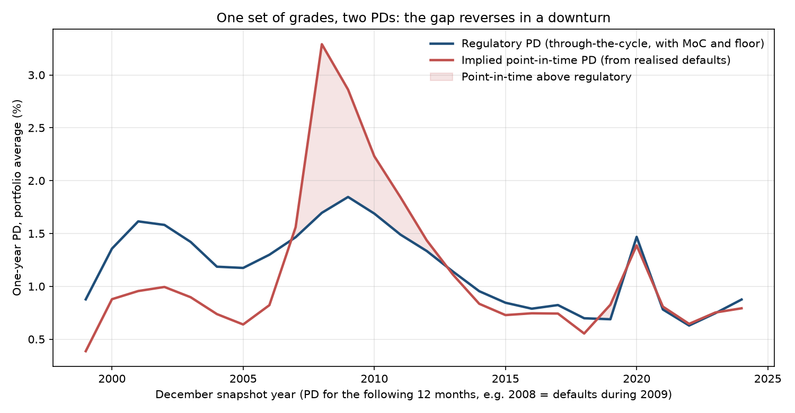

# HYBRID — UK Basel 3.1 IRB capital and IFRS 9 ECL from one parameter set

Estimate PD, LGD and EAD **once** from loan-level data, then drive **two** regulatory
outputs from those same parameters: UK Basel 3.1 IRB risk-weighted assets and IFRS 9
expected credit loss. The centrepiece is a hybrid PD model producing a through-the-cycle
regulatory estimate and a point-in-time accounting estimate from one ranking model, with
a fully quantified reconciliation between them.

Built to UK final rules: **PRA PS1/26**, **SS4/24**, **SS1/23**. Effective 1 January 2027.

---

## Results so far

Freddie Mac loan-level data, 27 origination vintages (1999–2025), 1.35 million loans,
75 million loan-months.



**One set of grades, two PDs.** Each point is a December snapshot and the PD for the
following 12 months - so "2008" means loans observed in December 2008, defaulting during
2009. The regulatory PD sits 1.5–1.8× above the implied point-in-time PD in benign years;
for the 2008 snapshot the point-in-time PD is almost double it (3.29% vs 1.70%). Neither
is wrong - one is built to be stable and conservative, the other to be unbiased now.

**What "implied point-in-time PD" means here:** it is backed out from the defaults that
actually happened (the realised economic factor each year), so it matches the observed
default rate by construction. It shows what an unbiased IFRS 9 PD *should have been*. A
forward-looking IFRS 9 PD needs the economic factor forecast from macro scenarios - the
next workstream.

| | |
|---|---|
| Long-run average one-year default rate | 1.17% pooled across all loan-months, 1.12% averaging years equally (1999–2024). Grade PDs use equal weighting per year |
| Behavioural scorecard Gini — development / out-of-sample / **out-of-time** | 0.804 / 0.804 / **0.805** |
| Rating grades | 11, default rates monotonic from 0.01% to 40% |
| UK 0.10% PD floor | binds for grades 1–3, 27.8% of the book |
| IFRS 9 conversion correlation | 0.031 estimated from data (Basel 0.15 kept for capital) |

Every judgement behind these numbers - and every defect found along the way - is in
[`docs/FINDINGS_LOG.md`](docs/FINDINGS_LOG.md).

### Data and terms of use

Source: [Freddie Mac Single-Family Loan-Level Dataset](https://www.freddiemac.com/research/datasets/sf-loanlevel-dataset),
Release 47 sample files. **This repository contains no Freddie Mac data** and none of its
documentation. To reproduce the results, obtain the files from Freddie Mac under its
*Terms and Conditions for the Single-Family Loan-Level Dataset* - see
[`docs/DATA.md`](docs/DATA.md).

This is a noncommercial research project. Published outputs are aggregate results only -
counts and default rates by year, vintage and grade, and model coefficients - which cannot
be used to recreate any part of the dataset or identify any individual. The loan
identifiers in `tests/` are invented, attached to synthetic values. The project is not
affiliated with or endorsed by Freddie Mac, which provides the dataset as is and without
warranty.

---

## Status

| Workstream | State |
|---|---|
| Config, package scaffold | Done |
| Synthetic data generator | Done |
| Freddie Mac loader, Release 47 (July 2026) format | Done — all 27 sample vintages 1999–2025, 1.35m loans; see `docs/FINDINGS_LOG.md` |
| Loan-month panel + definition of default (DuckDB) | Done |
| IRB capital engine + UK floors + output floor | Done |
| Vasicek TTC ↔ PIT transform | Done |
| IFRS 9 ECL engine + staging | Done |
| WOE / IV / score scaling | Done |
| Behavioural PD scorecard (ranking) | Done — Gini 0.804 dev / 0.805 out-of-time |
| TTC calibration, floors, MoC, Vasicek bridge | Done — MoC items A1.1, A2.1, B.2 pending quantification |
| Macro data (FRED, FHFA) → rate spread, indexed LTV, scenario Z | Next |
| Workout LGD | Not started |
| EAD / CCF / prepayment | Not started |
| Validation suite | Not started |
| Dashboard, MDD, validation report | Not started |

`pytest` — 143 passing.

---

## Quick start

```bash
python -m venv .venv && source .venv/bin/activate
pip install -e ".[dev]"

python -m hcr.data.synthetic        # generate a synthetic panel (~2 min)
python scripts/run_pipeline.py      # build panel, run DoD variants, demo the engines
pytest -q                           # 143 tests
```

With the Freddie Mac sample files in `data/raw/freddie/` (see [`docs/DATA.md`](docs/DATA.md)):

```bash
python scripts/vintage_summary.py   # loader checks and default history, all vintages
python scripts/build_pd_sample.py   # annual snapshots for the PD model (~5-15 min)
python scripts/fit_scorecard.py     # behavioural scorecard -> outputs/scorecard/
python scripts/calibrate.py         # regulatory + IFRS 9 PD, the bridge -> outputs/calibration/
```

Everything runs on synthetic data out of the box. Real data is a drop-in — see
[`docs/DATA.md`](docs/DATA.md).

---

## Why this design

**One data spine, two regimes.** Banks run capital and provisioning off the same
underlying estimates and spend real effort explaining why the two disagree. This repo
makes that reconciliation the product rather than an afterthought.

**The two PD philosophies are kept physically separate.** `engines/irb.py` consumes
through-the-cycle, floored, conservatism-loaded parameters. `engines/ecl.py` consumes
point-in-time, unbiased parameters and will raise if you hand it regulatory ones:

```python
ecl.assert_unbiased_inputs(pd_values, moc_applied=True, downturn_lgd=False)
# ValueError: Margin of conservatism must not be applied to IFRS 9 PD.
```

**SQL for data, Python for models.** The panel is large and the definition-of-default
logic is naturally a window-function problem — finding each loan's first 90 DPD month,
tracking a probation streak, deciding whether a re-default is a new event. DuckDB does
it in one pass with no server to run.

**Every regulatory number is in config, with a source.** Parameter floors, correlations
and the output floor phase-in live in `config/uk_basel31.yaml`, not scattered through
the code. `config.py` validates them at import — it refuses to load a scaling factor
other than 1.0, scenario weights that don't sum to 1, or a probation period below the
regulatory minimum.

---

## Layout

```
config/           uk_basel31 · default_definition · ifrs9 · moc · data
src/hcr/
  config.py       loading + validation
  data/           synthetic generator; Freddie Mac loader
  default_def/    DuckDB panel builder and DoD state machine
  features/       WOE, information value, monotonic binning, score scaling
  pd/             development sample; scorecard; calibration; Vasicek TTC↔PIT
  engines/        irb.py · ecl.py
tests/            143 tests
docs/             DATA.md · FINDINGS_LOG.md
```

Planned, not yet built: SBA and FRED/FHFA loaders, the revised standardised approach
(`engines/standardised.py`), workout LGD (`lgd/`), EAD/CCF and prepayment (`ead/`), the
validation suite (`validation/`), the MDD and the validation report. The empty package
folders are placeholders for these.

```
```

---

## What the engines do

**IRB capital** — `K = LGD·Φ[(Φ⁻¹(PD) + √R·Φ⁻¹(0.999))/√(1−R)] − PD·LGD`, `RWA = K×12.5×EAD`.
Retail correlations (0.15 mortgage, 0.04 QRRE, supervisory function for other retail),
no maturity adjustment, **no 1.06 scaling factor** — removed under Basel 3.1.

**UK floors** — PD floors of 0.10% (mortgages, QRRE transactors) and 0.05% (QRRE
revolvers, other retail). LGD floors of 5% account-level and 10% exposure-weighted
portfolio-level for mortgages, 50% QRRE, 30% other unsecured. The mortgage portfolio
floor is applied as a proportional scale-up, since it binds on the average not the account.

**Output floor** — `max(RWA_IRB, floor% × RWA_SA)` across the 2027→2030 phase-in
(60% from 2027, 65%, 70%, fully loaded 72.5% from 1 January 2030, per PS1/26).

**Vasicek bridge** — `PD_PIT = Φ[(Φ⁻¹(PD_TTC) − √R·Z)/√(1−R)]`, with `Z > 0` benign.
Two identities are asserted in tests: `E[PD_PIT]` over `Z ~ N(0,1)` equals `PD_TTC`, and
evaluating at `Z = Φ⁻¹(0.001)` reproduces the Basel conditional PD exactly — regulatory
capital *is* point-in-time PD at a 1-in-1,000 economy with expected loss removed.

**IFRS 9 ECL** — `Σ PD_marginal(t)·LGD(t)·EAD(t)·(1+EIR)⁻ᵗ`, staging on a relative SICR
trigger plus absolute backstop plus the 30 DPD presumption, probability-weighted across
four scenarios with the non-linearity uplift reported separately.

---

## Notes on correctness

Worked examples in the tests are checked against Basel benchmark risk weights and against
analytic identities rather than against the implementation's own output. A few that earn
their keep:

- marginal PD must equal `S(t−1) − S(t)`, not the hazard rate — using the hazard overstates ECL and the error compounds through the term
- the corporate maturity adjustment normalises to 1.0 at `M = 1`, not `M = 2.5`
- WOE uses `ln(good/bad)` throughout, so higher WOE means lower risk; the module refuses to be configured the other way

The definition-of-default state machine is tested against hand-constructed delinquency
sequences where the answer is known by hand. That suite immediately caught a live bug:
`NULL IN (...)` returns NULL in SQL, not FALSE, so `raw_flag` was NULL on every row
without a zero-balance code, `NOT raw_flag` was NULL, the exit condition never fired and
**no loan ever cured out of default** — silently turning the probation rule into a no-op.
Fixed with `COALESCE`; regression test is
`test_longer_probation_keeps_loan_in_default_longer`.

---

## Data

Synthetic by default. For real data see [`docs/DATA.md`](docs/DATA.md) — Freddie Mac
Single-Family Loan-Level (requires free registration and licence acceptance), SBA 7(a)
FOIA for the SME workstream, FRED and FHFA for macro. Raw data is not committed.

The methodology is jurisdiction-agnostic; the calibration is not. US data is used because
it is the only public source providing loan-level recovery cash flows together with a full
downturn cycle, both prerequisites for workout LGD and downturn estimation. UK rules are
applied to it throughout.
